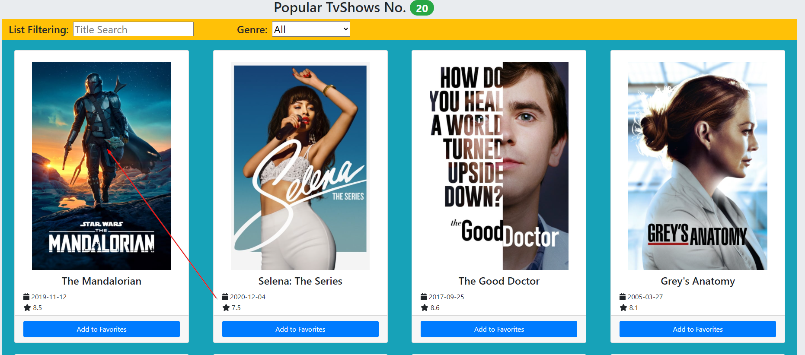
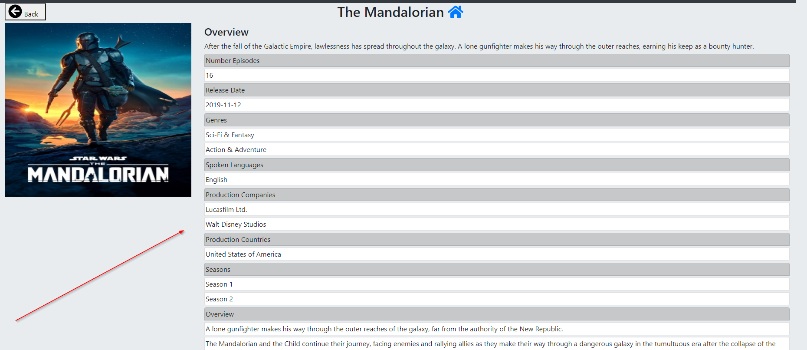
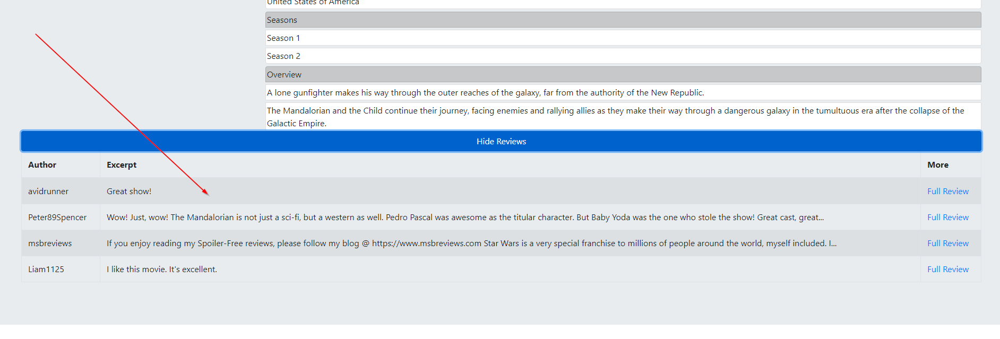
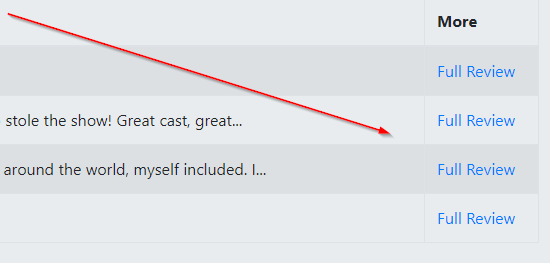
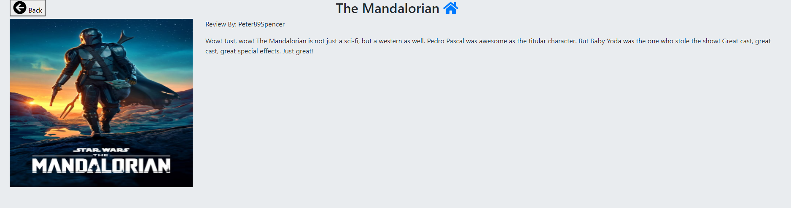
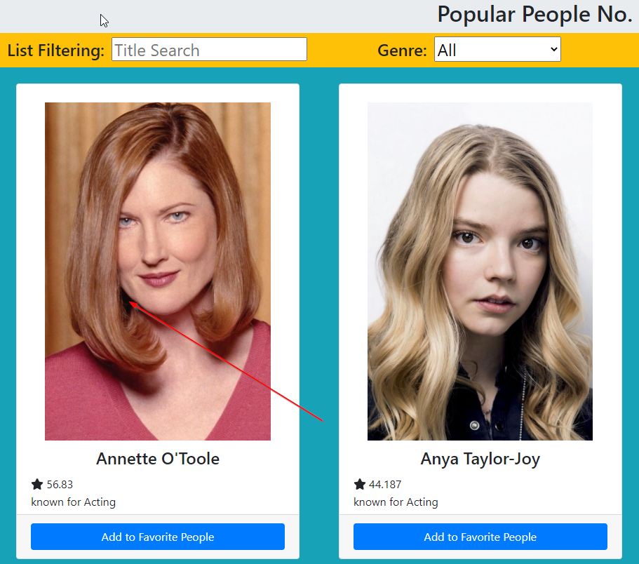
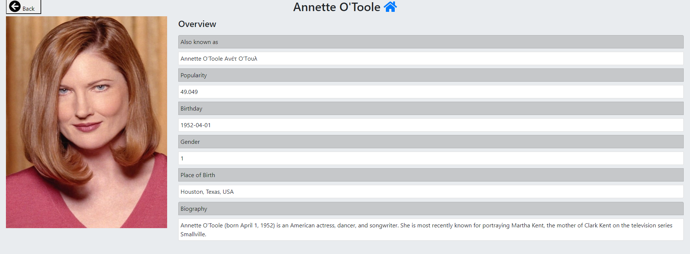

# Assignment 1 - ReactJS app.

Name: Conor Casey

## Features.

...... A bullet-point list of the ADDITIONAL user features you have implemented for the  Movies Fan app ......,
 
 + Feature 1 - Popular TvShows Page: Page that lists what Tv shows are popular with the poster, release date and rating.
 + Feature 2 - Top Rated TvShows: Page that lists the highest rated tv shows with the poster, release date and rating.
 + Feature 3 - Currently Airing: Page that shows what tv shows are currently on the air with the poster, release date and rating.
 + Feature 4 - Favorite Shows: Page that shows tv shows added from the favorite button on popular tv shows.
 + Feature 5 - Currently Watching: Page that shows tv shows added from the add to currently watching button on currently airing.
 + Feature 6 - Planned To Watch: Page that shows tv shows from added from the plan to watch button on planned to watch page.
 + Feature 7 - Favorite Shows: Page that shows tv shows added from the favorite button on popular tv shows.
 + Feature 8 - Popular People: Page that lists the currently popular people on tmdb.
 + Feature 9 - Favorite People: Page that shows favorite people added from popular people.
 + Feature 10 - Tv Show Details: Page that shows details about the currently selected tvshow.
 + Feature 11 - Person Details: Page that shows details about the currently selected person.
 + Feature 12 - New Nav Bar: Created a new navbar that uses react bootstrap eith dropdowns to improve appearance.

## Setup requirements (If required).

...... A brief explanation of any non-standard setup steps necessary to run your app/client locally (after cloning the repo) ........

+ npm install
+ npm install cypress
+ npm install bootstrap
+ npm install react-bootstrap 
+ npm install -g http-server
+ npm run
+ npm cypress run (for testing)

## API Data Model.

..... List the additional TMDB endpoints used in your assignment, e.g.

+ https://api.themoviedb.org/3/movie/${id} - get detailed information on a specific movie. 
+ https://api.themoviedb.org/3/genre/movie/list - get a list of movie genres
+ https://api.themoviedb.org/3/discover/movie - Get all movies
+ https://api.themoviedb.org/3/movie/${id}/reviews - Get all movie reviews
+ https://api.themoviedb.org/3/movie/upcoming - Get all upcoming movies
+ https://api.themoviedb.org/3/person/popular - Get all popular people
+ https://api.themoviedb.org/3/person/${id} - get information on a specific person
+ https://api.themoviedb.org/3/discover/tv - get all tv shows 
+ https://api.themoviedb.org/3/tv/${id} - get information on a particular tv show
+ https://api.themoviedb.org/3/tv/${id}/reviews - get all tv reviews on a particular tv show
+ https://api.themoviedb.org/3/tv/on_the_air - Get all tv shows currently airing
+ https://api.themoviedb.org/3/tv/top_rated - Get all top rated shows

## App Design.
### UI Design.

...... Insert screenshots of the new/modified views you have added to the Movies Fan app. Include a caption for each one clearly stating its purpose and any user interaction it supports ........

![][peopleDropDown]
>New navigation bar implemented as there was too many elements on display to work with original nav bar.

![][moviesDropDown]
>Contents of the movies drop menu

![][tvShowsDropDown]
>Contents of the TvShows drop menu

![][peopleDropDown]
>Contents of the people drop menu

![][popularTvShows]
>Lists currently popular shows with the option to favorite them

![][airingPage]
>Lists currently airing shows with the option to add them to currently watching list

![][topRatedShowsPage]
>Lists currently top rated shows with the option to add them to plan to watch

![][favoriteTvShowsPage]
>Lists currently favorited shows from the popular tv shows page

![][currentlyWatchingPage]
>Lists currently watching shows from the airing shows page

![][planToWatchPage]
>Lists currently planning to watchshows from the top rated shows page

![][popularPeoplePage]
>Lists currently popular actors with the option to favorited them

![][favoritePeoplePage]
>Lists currently favorited actors

![][peopleDetailsPage]
>Lists all the details about the actor you have clicked.

![][tvShowPage]
>Lists all the details about the tvshow you have clicked with the option to look at reviews

![][showReview]
>Shows a full review once clicked about the tvshow you have clicked

## Routing.

...... Insert a list of the additional routes supported by your Movies Fan app. If relevant, specify which of the routes require authentication, i.e. protected/private.

+ /movies/favorites - displays the user's favorite movies selection.
+ /reviews/:id - displays the full text of a movie review.
+ /movies/upcoming - displays upcoming movies.
+ /movies/watchlist - displays movie watchlist 
+ /movies/:id - displays movie details
+ /movies/:id/reviews - displays movie reviews
+ /tvShows/popular - displays popular tv shows
+ /tvShows/topRated - Displays top rated tv shows
+ /tvShows/airing - Displays currently airing tv shows
+ /tvShows/favorites - Displays favorite tvshows
+ /tvShows/currentlyWatching - Currently watching shows
+ /tvShows/plannedToWatch - Planned to watch shows
+ /tvShow/:id - Displays details about a tv show
+ /tvShow/:id/reviews - Displays reviews of a tv show
+ /tvShowReviews/:id - Displays a full review
+ /people/popular - Displays popular people
+ /people/favorites - Displays favorite people
+ /people/:id - Displays person details

### Data hyperlinking.

.... Use screenshots to illustrate where data hyperlinking is present in your views - include captions.

> 

> Clicking a card causes the display of that movie's details.

> Clicking show reviews fetches reviews.

> Clicking shows the full review.

> Displays full review.

> Clicking person photo will show details.

> Showing details.

## Independent learning (If relevant).

. . . . . Briefly mention each technologies/techniques used in your project codebase that were not covered in the lectures/labs. Provide source code filename references to support your assertions and include reference material links (articles/blogs).

https://react-bootstrap.github.io/components/dropdowns/ - Used for the nav bar

---------------------------------

[navBar]: ./public/navbar.png
[moviesDropDown]: ./public/moviesDropDown.png
[tvShowsDropDown]: ./public/tvShowsDropDown.png
[peopleDropDown]: ./public/peopleDropDown.png
[popularTvShows]: ./public/popularTvShows.png
[airingPage]: ./public/airingPage.png
[topRatedShowsPage]: ./public/topRatedShowsPage.png
[favoriteTvShowsPage]: ./public/favoriteTvShowsPage.png
[currentlyWatchingPage]: ./public/currentlyWatchingPage.png
[planToWatchPage]: ./public/planToWatchPage.png
[popularPeoplePage]: ./public/popularPeoplePage.png
[favoritePeoplePage]: ./public/favoritePeoplePage.png
[peopleDetailsPage]: ./public/peopleDetailsPage.png
[tvShowPage]: ./public/tvShowPage.png
[showReview]: ./public/showReview.png

